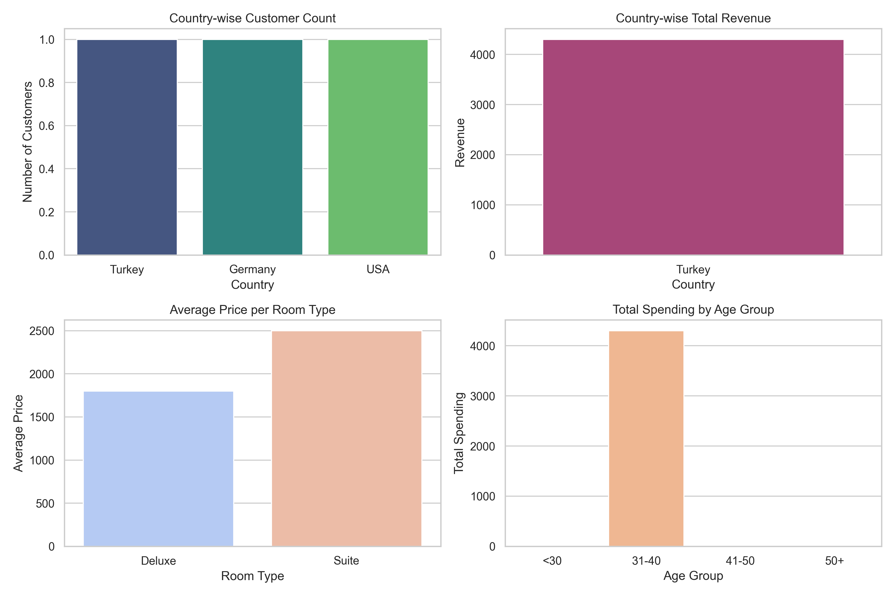

# RoomMetrics: Hotel Customer & Reservation Data Analysis

## Project Overview
RoomMetrics is a data analysis project focused on hotel customer and reservation data. It demonstrates how to:

- Load and manage data from MongoDB
- Perform data analysis using Python (Pandas)
- Conduct business insights such as average stay length, total spending, cancellation rates, and customer segmentation
- Visualize key metrics with charts (matplotlib & seaborn)

## Technologies Used
- Python (pandas, pymongo, matplotlib, seaborn)
- MongoDB (NoSQL database)
- Jupyter Notebook / Python scripts
- Git & GitHub for version control

## Key Analyses Performed
- Average length of stay per reservation
- Total spending per customer (excluding cancelled reservations)
- Top customers by number of reservations
- Cancellation rate calculation
- Customer distribution by country and age group
- Revenue analysis by country and room type

## Visualizations
Several charts are generated and saved under the `visuals/` directory, including:

- Customer count by country
- Revenue by country
- Average room price by room type
- Total spending by age group

